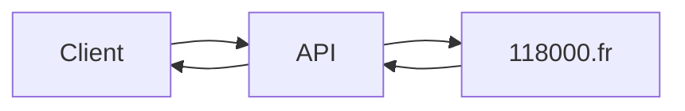

# scrap-cpn-phone

API de recherche du numéro de téléphone des entreprises françaises, basée sur du web scraping.

## Cahier des charges

```sh
Idée globale : Créer une API en Node.js, avec une seule route qui prend en paramètre le nom d’une entreprise française,
et qui renvoie en JSON son numéro de téléphone, trouvé sur le web par les moyens de ton choix.

Exemple : La route prendrait en paramètre EXPERDECO (et éventuellement d’autres informations que l’on a sur l’entreprise, comme le SIREN ou l’adresse) et renverrait +33 450346354.
```

## Problèmes rencontrés et solution proposée

### Problèmes rencontrés

- Je n’ai pas trouvé une API retournant le numéro de téléphone de la société.

- La plupart des sites web proposent le numéro de téléphone par un service payant.

- Le site 118000.fr renvoie bien le téléphone mais ne permet pas de recherche basée sur le SIREN.
  Il est possible d’interroger l’API de data.gouv.fr sur le numéro de SIREN et de renvoyer le nom et l’adresse à 118000.fr pour récupérer le téléphone.
  Cependant, les résultats renvoyés sont généralement multiples et il faut appeler une nouvelle page de détail pour chaque entreprise et filtrer sur le SIREN. Ce qui fini par une page captcha.

### Solution proposée

- Je ne suis pas parti sur une route en GET mais en POST pour la praticité avec un client REST.
- API de scrape sur le site 118000.fr.
- Je n’ai pas implémenté l’option siren.

## Dépendances

L'API se compose des dépendances suivantes :

| package | description                         |
| ------- | ----------------------------------- |
| express | Minimalist web framework            |
| axios   | Promise based HTTP client           |
| cheerio | Implements a subset of core jQuery  |
| jest    | (DEV) Delightful JavaScript Testing |

## Fonctionnement



## Request API

- Endpoint: http://localhost:3001/api/company

- Method: POST

- Request Body Parameters:

```json
{
  "name": "name",
  "address": "address" (optional)
}
```

## API Reponses

Success:

```json
{
  "status": "Success",
  "message": "Phone number found",
  "phone_number": "+33 171684264"
}
```

Warning:

```json
{
  "status": "Warning",
  "message": "2 results for la cabane de leon, first result returned... Please retry with options",
  "phone_number": "+33 360455457"
}
```

Error:

```json
{
  "status": "Error",
  "message": "Nothing found for tttttttt"
}
```

## Données

| Dataset                            | usage               |
| ---------------------------------- | ------------------- |
| [118000.fr](https://www.118000.fr) | Scraping non permis |

## Pré-requis

Pour lancer le projet, les outils doivent être présent sur la machine:

- node
- npm

## Lancement du projet

```sh
cd scrap-cpn-phone

npm install
npm test
npm start
```
